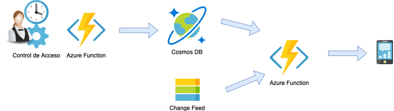
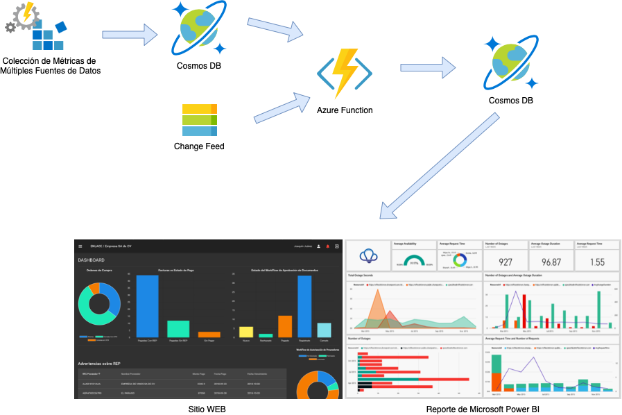

# Escenarios GlobalAzureBootCamp2019
## Presentación: Aplicaciones Prácticas con CosmosDB y Azure Functions

### Diagrama 1: Detección de Personal No Autorizado según Horario 

### Diagrama 2: Referencias a Documentos

### Diagrama 3: Expiración de Documentos

### Diagrama 4: Reportes y Tableros de datos para toma de decisiones

